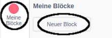
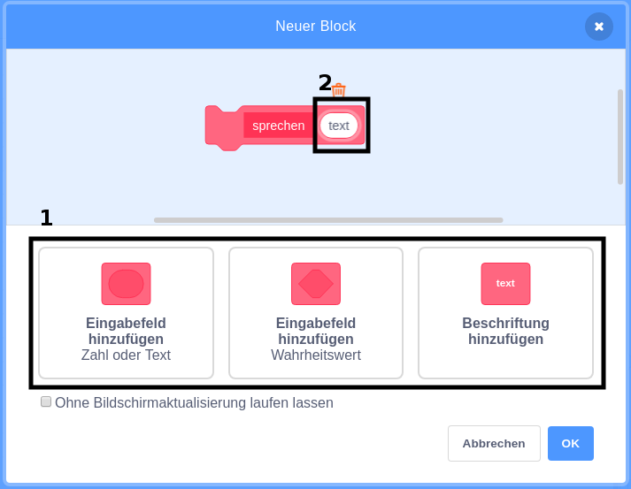
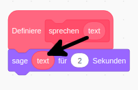
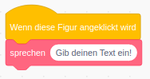
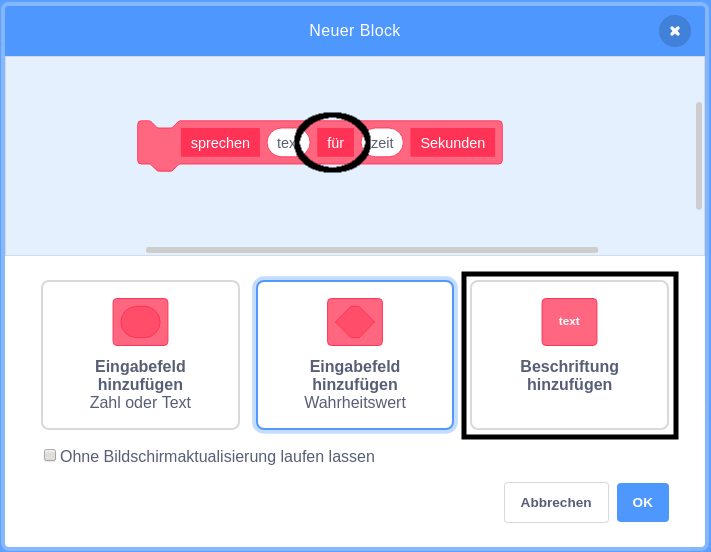

+ Klicke auf **Meine Blöcke** und dann auf **Neuer Block**.

+ Sie können Blöcke mit "Lücken" erstellen, um Daten hinzuzufügen. Diese "Lücken" werden **Parameter** bezeichnet. Um Parameter hinzuzufügen, klicke auf die folgenden Optionen, um den Typ der Daten auszuwählen, den du hinzufügen möchtest. Dann gibst du deinen Daten eine Name und klickst auf **OK**.

+ Du kannst dann deinen neuen Block definieren und die Daten verwenden, indem du die kreisförmigen Elemente in den entsprechenden Code zu ziehst.

+ Jetzt fügst du Daten als Parameter in die Lücken deinen neuen Blocks ein.

+ Verwenden den neuen `Definieren` Block mit den Lücken, die du gefüllt hast, indem du die Code hinzugefügt hast und ihn deinem Skript hinzugefügt hast.

+ If you want to add some text between parameters, you can add label text:

