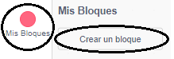
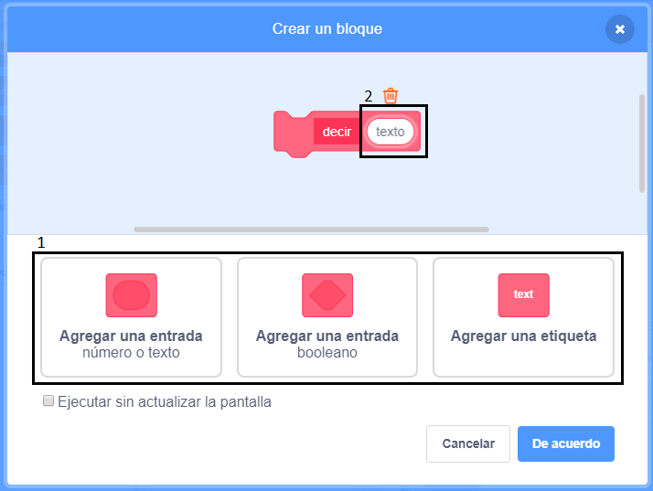
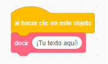
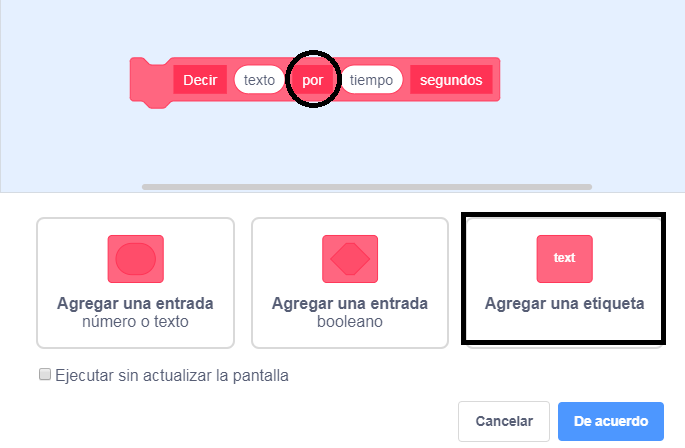

+ Haz clic en **Mis bloques** y luego haz clic en **Crear un bloque**.

+ Puedes crear bloques que tengan 'espacios' para agregar datos. Estos 'espacios' se llaman **parámetros**. Para agregar parámetros, haz clic en las opciones a continuación para elegir el tipo de datos que desea agregar. Luego da un nombre a tus datos y haz clic en **OK**.

+ Luego puedes definir tu nuevo bloque y usar los datos al arrastrar los bloques circulares para usarlos en tu código.

+ Ahora agrega datos como parámetros en los espacios de tu nuevo bloque.

+ Usa el nuevo bloque `definir` con los espacios que has rellenado al adjuntarle un código y al añadirlo a tu secuencia de comandos.

+ Si quieres agregar texto entre los parámetros, puedes agregar texto de etiqueta:

