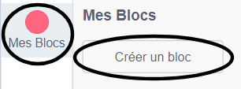
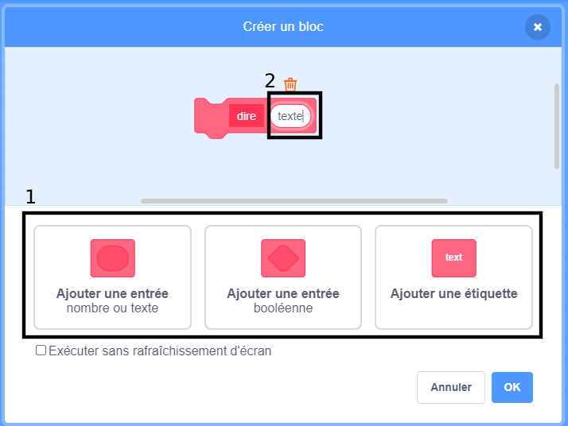
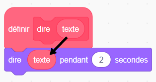
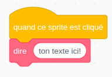
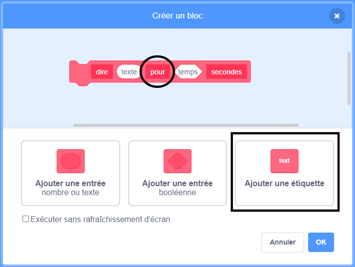

+ Clique sur **Mes Blocs**, puis clique sur **Créer un Bloc**.

+ Tu peux également créer des blocs qui ont des « espaces » pour ajouter des données. Ces « espaces » sont appelés **paramètres**. Pour ajouter des paramètres, clique sur les options ci-dessous pour choisir le type de données que tu souhaites ajouter. Ensuite, donne un nom à tes données et clique sur **OK**.

+ Tu peux alors définir ton nouveau bloc et utiliser les données en faisant glisser les blocs circulaires pour les utiliser dans ton code.

+ Maintenant, tu ajoutes des données comme paramètres dans les espaces de ton nouveau bloc.

+ Utilise le nouveau bloc `définir` avec les espaces que tu as remplis en y attachant du code et en l'ajoutant à ton script.

+ Si tu veux ajouter du texte entre les paramètres, tu peux ajouter une étiquette :

