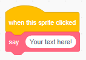

+ **My Blocks** पर क्लिक करें और फिर **Make a Block** दबाएं |

+ आप ऐसे ब्लॉक बना सकते हैं जिनमें डेटा जोड़ने के लिए 'जगह' हों। इन 'जगहों' को **पैरामीटर (parameters)** कहते हैं। पैरामीटर जोड़ने के लिए, आप जिस प्रकार का डेटा जोड़ना चाहते हैं उसे चुनने के लिए नीचे दिए गए विकल्पों पर क्लिक करें। फिर अपने डेटा को कोई नाम दें, और **OK** पर क्लिक करें।

+ फिर आप अपने नए ब्लॉक को परिभाषित कर सकते हैं, और सर्कुलर ब्लॉकों को ड्रैग करके उन्हें अपने कोड में उपयोग करके डेटा का उपयोग कर सकते हैं।

+ अब आप डेटा को अपने नए ब्लॉक के जगहों में पैरामीटर के रूप में जोड़ सकते हैं।

+ आपके द्वारा भरे गए जगहों के साथ नए `define` ब्लॉक का उपयोग कर कोड संलग्न करें और उसे अपनी स्क्रिप्ट में जोड़ें।

+ यदि आप पैरामीटरों के बीच कुछ टेक्स्ट जोड़ना चाहते हैं, तो आप लेबल टेक्स्ट जोड़ सकते हैं:

