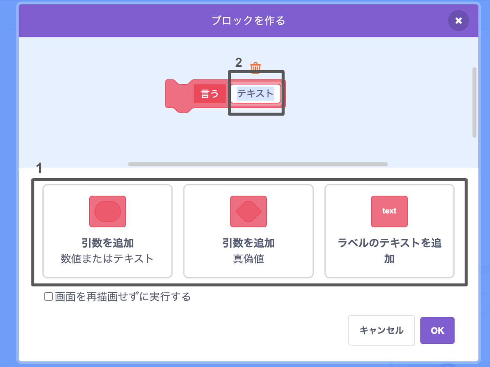
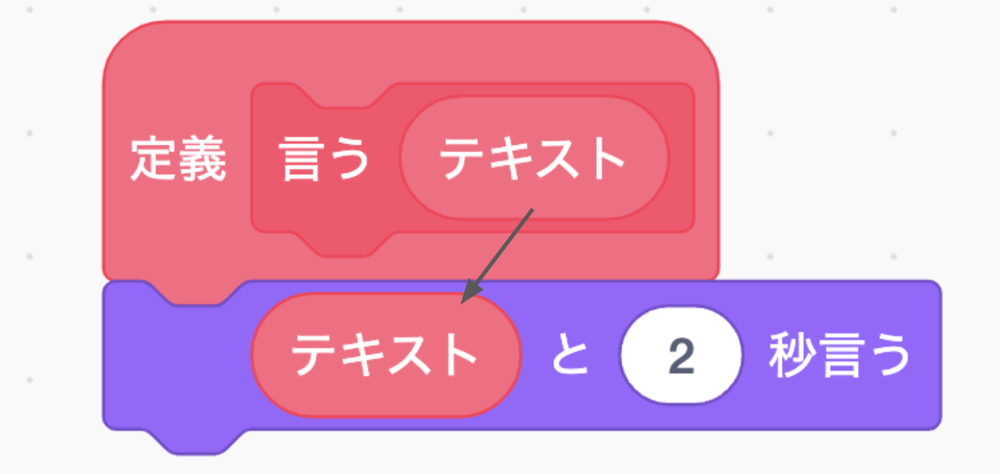
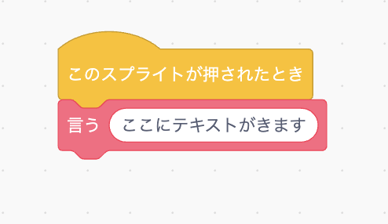
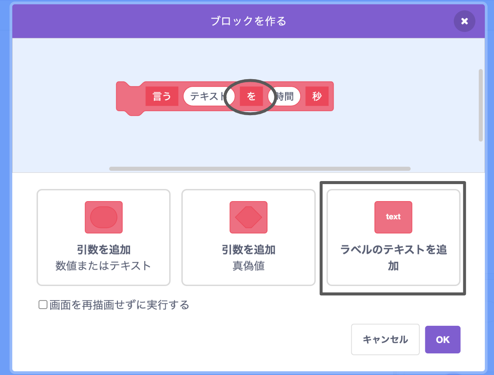

+ **ブロック定義**をクリックし、次に **ブロックを作る**をクリックします。

+ データを追加するための「ギャップ」を持つブロックを作成できます。 これらの「ギャップ」は、 **パラメーター**と呼ばれます。 パラメーターを追加するには、以下のオプションをクリックして、追加するデータの種類を選択します。 次に、データに名前を付けて、**OK**をクリックします。

+ 次に、新しいブロックを定義し、円形のブロックをドラッグしてコード内でデータを使用します。

+ 次に、新しいブロックのギャップにデータをパラメーターとして追加します。

+ コードを添付してスクリプトに追加することで、ギャップを埋めた新しい `定義` ブロックを使用します。

+ パラメーター間にテキストを追加する場合は、ラベル テキストを追加できます。

