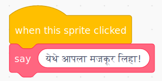

+ **My Blocks** वर क्लिक करा आणि नंतर **Make a Block** वर क्लिक करा.

+ आपण डेटा जोडण्यासाठी 'अंतर' असलेल्या ब्लॉक तयार करू शकता. हे 'अंतर'ला **पॅरामीटर्स** म्हणतात. पॅरामीटर्स जोडण्यासाठी, आपण जो डेटा जोडू इच्छिता तो निवडण्यासाठी खालील पर्यायांवर क्लिक करा. मग आपल्या डेटाला एक नाव द्या, आणि क्लिक करा **OK**.

+ त्यानंतर आपण आपला नवीन ब्लॉक परिभाषित करू शकता आणि आपल्या कोडमध्ये गोलाकार ब्लॉक्स वापरुन डेटाचा वापर करू शकता.

+ आता आपण आपल्या नवीन ब्लॉकच्या अंतरांमध्ये पॅरामीटर्स म्हणून डेटा जोडा.

+ नवीन `define` ब्लॉक वापरा आणि त्यामध्ये कोड संलग्न करुन आपल्या स्क्रिप्टवर जोडून अंतर भरा.

+ आपण पॅरामीटर्समध्ये काही मजकूर जोडू इच्छित असल्यास, आपण लेबल मजकूर जोडू शकता:

