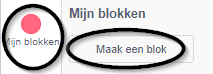
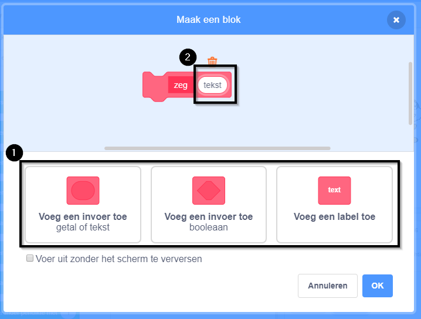
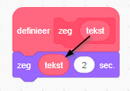
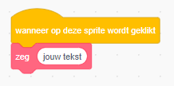
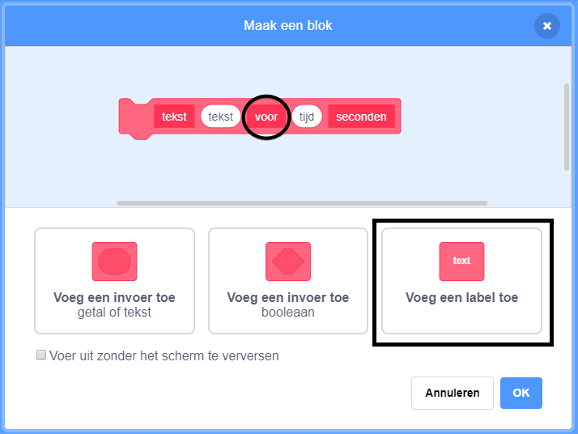

+ Klik op **Mijn blokken**en klik vervolgens op **Maak een blok**.

+ Je kunt blokken met 'gaten' maken om gegevens toe te voegen. Deze 'gaten' worden **parameters** genoemd. Om parameters toe te voegen, klik je op een van de onderstaande opties om het type parameter te kiezen dat je wilt toevoegen. Geef vervolgens je parameter een naam en klik op **OK**.

+ Je kunt vervolgens je nieuwe blok definiëren en de gegevens gebruiken door de cirkelblokken te verslepen om ze in je code te gebruiken.

+ Nu voeg je gegevens als parameters toe aan de gaten van je nieuwe blok.

+ Gebruik het nieuwe `definieer` blok met de gaten die je hebt gevuld door er code aan toe te voegen en deze aan je script toe te voegen.

+ Als je wat tekst tussen de parameters wilt toevoegen, kun je een tekstlabel toevoegen:

