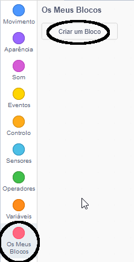
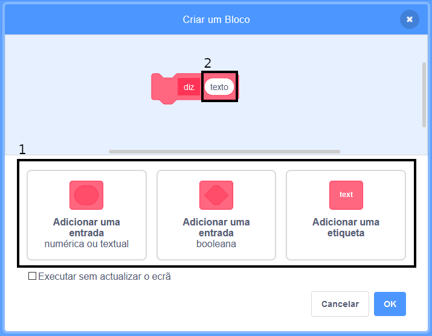
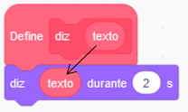
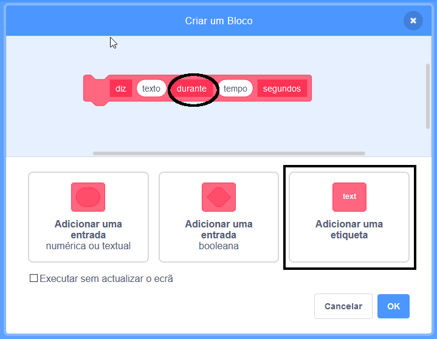

+ Clique em **Os Meus blocos** e, em seguida, clique em **Criar um bloco**.

+ Podes criar blocos que tenham 'espaços' para adicionar dados. Estes 'espaços' são chamados de **parâmetros**. Para adicionar parâmetros, clica nas opções em baixo para escolher o tipo de dados que desejas adicionar. Em seguida, dá um nome aos teus dados e clica em **OK**.

+ Podes então definir o teu novo bloco e usar os dados arrastando os blocos circulares para usá-los no teu código.

+ Agora podes adicionar dados como parâmetros nos espaços do teu novo bloco.

+ Usa o novo bloco `define` com os espaços preenchidos, anexando-o ao código e adicionando-o ao teu guião.

+ Se desejas adicionar algum texto entre os parâmetros, podes adicionar o texto do rótulo:

