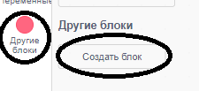
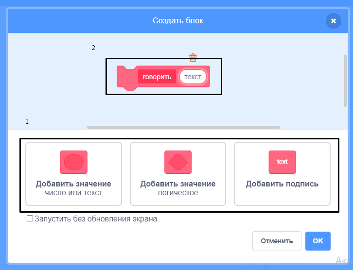
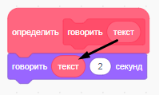
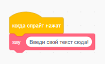
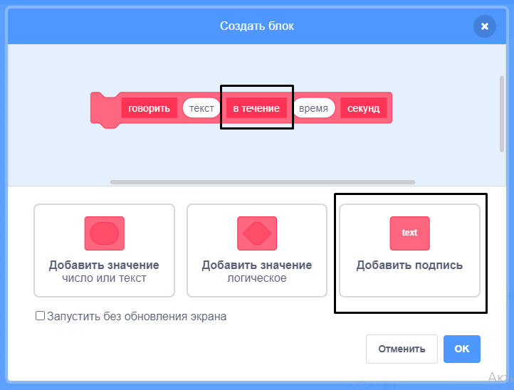

+ Нажми **Другие блоки**, а затем нажми **Создать блок**.

+ Ты можешь создавать блоки с «пробелами» для добавления данных. Эти «пробелы» называются **параметрами**. Чтобы добавить параметры, нажми на параметры ниже, чтобы выбрать тип данных, которые ты хочешь добавить. Затем дай твоим данным имя и нажми **OK**.

+ Затем ты можешь определить свой новый блок и использовать данные, перетаскивая круглые блоки, чтобы использовать их в своем коде.

+ Теперь ты добавляешь данные в качестве параметров в промежутки твоего нового блока.

+ Используй новый блок `определить` с пробелами, которые ты заполнил, прикрепив к нему код и добавив его в свой скрипт.

+ Если ты хочешь добавить текст между параметрами, ты можешь добавить текст метки:

