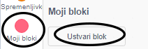
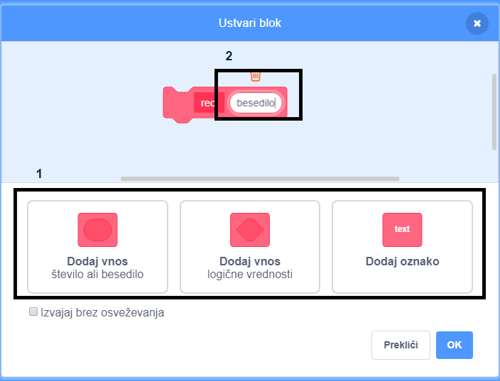
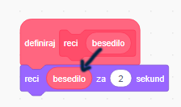
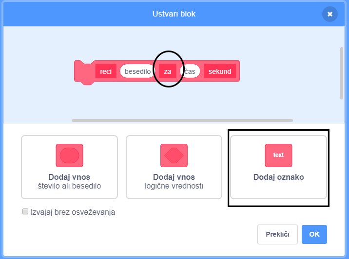

+ Klikni na **Moji bloki** in nato klikni na **Ustvari blok**.

+ Lahko ustvariš bloke, ki imajo 'luknje', v katere lahko dodaš podatke. Te 'luknje' imenujemo **parametri**. Za dodajanje parametrov klikni na spodnje možnosti, da izbereš vrsto podatka, ki ga želiš dodati. Nato poimenuj tvoj podatek in klikni **OK**.

+ Svoj novi blok lahko sedaj definiraš in dodaš podatke, tako da z miško vlečeš okrogle bloke in jih uporabiš v svoji kodi.

+ Zdaj dodaš podatke kot parametre v luknje tvojega novega bloka.

+ Uporabi novi blok `definiraj` z izpolnjemi luknjami, tako da mu dodaš kodo in da ga dodaš v svoj skript.

+ Če želiš dodati tekst med parametre, lahko uporabiš oznake:

