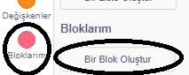
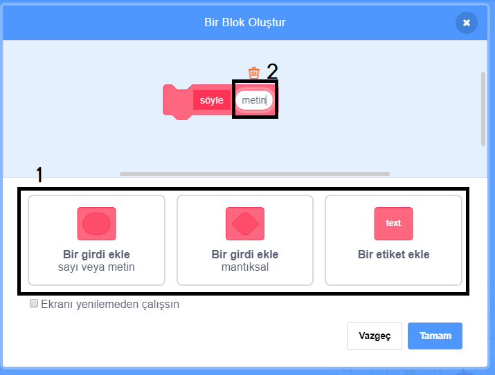
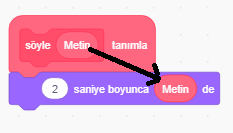
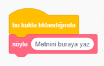
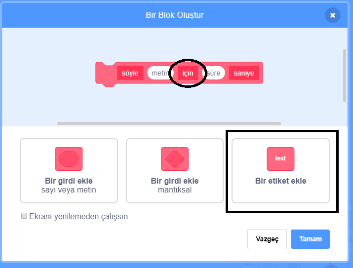

+ **Bloklarım** sekmesinden **Bir Blok Oluştur**'u tıklayın.

+ Sonradan veri eklemek için 'boşlukları' olan bloklar oluşturabilirsiniz. Bu 'boşluklar', **değişken** olarak adlandırılır. Değişken eklemek için, aşağıdaki seçeneklerden eklemek istediğiniz veri türünü tıklayın. Sonra verinize bir isim verin ve **Tamam**'ı tıklayın.

+ Daha sonra yeni bloğunuzu tanımlayabilir ve bu verileri kodunuzda kullanmak için dairesel blokları sürükleyebilirsiniz.

+ Şimdi yeni bloğunuzun boşluklarına değişken olarak veri ekleyin.

+ Kod iliştirip boşluklarını doldurduğunuz yeni `tanım` bloğunu komut dosyasına ekleyerek kullanın.

+ Değişkenler arasına başka metin yazmak istiyorsanız, etiketleri ekleyebilirsiniz:

